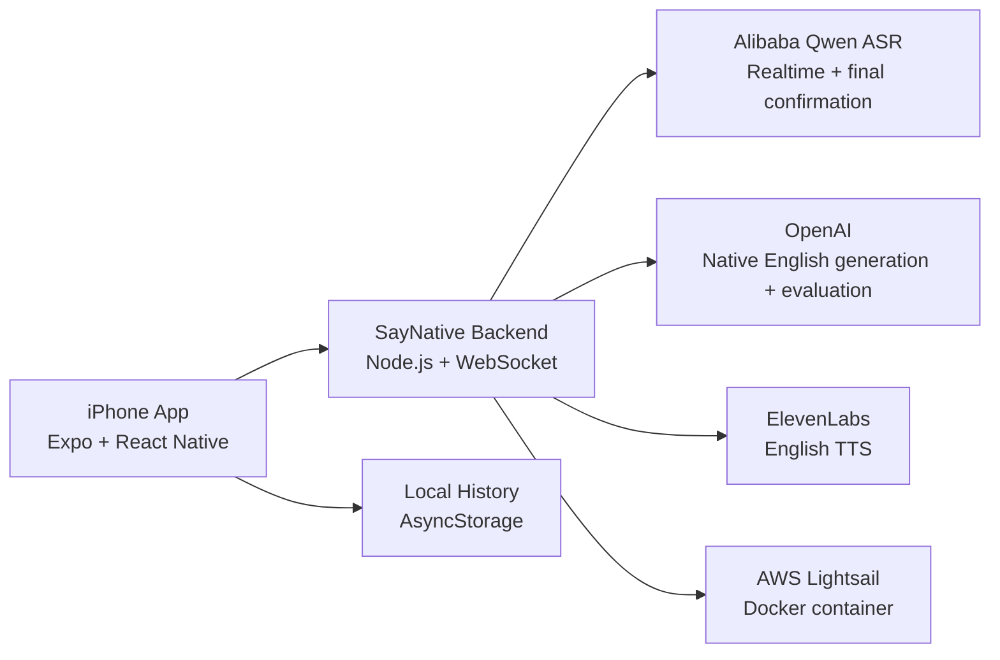

# SayNative

SayNative is an iPhone app that helps Chinese speakers practice natural spoken American English in real-life situations.

Users speak Chinese, optionally add a scene, receive native-sounding American English options, listen to the phrase, repeat it out loud, and get strict shadowing feedback.

## Why This Exists

Direct translation often produces English that is grammatically correct but not how Americans naturally speak in daily life. SayNative focuses on intent, context, and high-frequency spoken phrasing, so learners can practice the kind of English they actually need in restaurants, school, work, dating, and everyday conversations.

## Product Scope

SayNative is focused on one high-frequency learning loop:

1. Say what you want to express in Chinese.
2. Get natural spoken American English that matches the real situation.
3. Hear the sentence spoken aloud.
4. Repeat it until the wording is correct.
5. Save useful practice sentences for review.

The product intentionally avoids broad language-learning features at this stage. The goal is to make one daily practice loop fast, reliable, and habit-forming.

## Core Features

| Feature | API / System |
| --- | --- |
| Chinese realtime speech recognition | Alibaba Model Studio Qwen realtime ASR |
| Chinese final transcript confirmation | Alibaba Model Studio Qwen ASR |
| Scene capture | Alibaba Model Studio Qwen realtime ASR |
| Natural spoken American English generation | OpenAI |
| English text-to-speech for imitation | ElevenLabs |
| English repeat recognition | Alibaba Model Studio Qwen realtime ASR |
| Strict repeat evaluation | OpenAI JSON evaluation |
| Practice history | Local AsyncStorage |
| Backend deployment | AWS Lightsail container service |

## Product Flow

1. Tap `Scene` optionally and describe the context in Chinese.
2. Tap `Start` and say a Chinese sentence.
3. The app shows natural American English options.
4. Select or use the first option.
5. Listen to the English audio.
6. Tap `Practice` and repeat the phrase.
7. The app evaluates whether every meaningful word was repeated correctly.
8. Correct attempts trigger a short celebration and save to history.
9. Tap `Next` to clear the current sentence and start another prompt while keeping the scene.

## Product Principles

- **Native over literal:** prefer what an American would actually say over direct translation.
- **Context matters:** optional scene input changes phrasing, tone, and politeness.
- **Fast feedback:** realtime ASR gives immediate visibility while the final transcript is confirmed after stop.
- **Strict practice:** shadowing feedback checks the exact target phrase, not just similar meaning.
- **Low-friction repetition:** after a phrase is generated, users can practice it multiple times or move to the next sentence.

See [Native Rewrite Design](docs/native-rewrite-design.md) for the prompt and quality strategy behind SayNative's spoken English generation.

## Architecture



## Engineering Highlights

- **Realtime ASR streaming:** speech is streamed to the backend through WebSocket for faster feedback.
- **Final Chinese ASR confirmation:** after `Stop`, the full WAV recording is sent again to reduce missing words in short phrases.
- **Manual-mode English recognition:** repeat attempts are committed after the user taps `Stop`, which reduces lost first or last words.
- **Strict shadowing evaluation:** evaluation requires the learner to repeat every meaningful word, while allowing fillers and speech-recognition contraction variants.
- **Scene-aware generation:** optional scene context guides politeness, register, and phrase choice.
- **Backend secret boundary:** provider API keys stay on the Node backend and are never bundled into the iPhone app.
- **Cloud deployable backend:** Dockerized backend runs on AWS Lightsail.

## Reliability Decisions

| Problem | Current approach |
| --- | --- |
| Realtime ASR can miss short Chinese words | Confirm Chinese with full WAV audio after stop |
| English repeat attempts can lose the first or last word | Use manual ASR mode and commit after stop |
| Weak network may delay streaming results | Keep partial transcript fallback and final confirmation |
| API secrets cannot ship in the app | Route all provider calls through the backend |
| Learners need exact repetition feedback | Evaluate phrase chunks and missing/wrong words, not only meaning |

## Tech Stack

- Expo / React Native
- TypeScript
- Node.js
- WebSocket realtime transcription
- Alibaba Model Studio Qwen ASR
- OpenAI
- ElevenLabs
- AWS Lightsail
- EAS iOS builds

## Security

Provider API keys are never stored in the iPhone app.

The mobile app only receives `EXPO_PUBLIC_API_BASE_URL`. OpenAI, Alibaba, and ElevenLabs credentials live on the backend through environment variables.

See `.env.example` for required configuration.

## Development

```sh
npm install
npm run check
npm run backend
```

Run the iPhone app with Expo/Xcode or create an internal iOS build with EAS.

```sh
npx eas-cli build --platform ios --profile preview
```

## Roadmap

- TestFlight beta with external testers
- Demo video and product screenshots
- Better weak-network transcription recovery
- More detailed pronunciation feedback
- Scene presets for restaurants, school, work, dating, and travel
- Spaced repetition and streaks

## Project Status

Beta in active development. The backend is deployed on AWS Lightsail, and internal iPhone builds are distributed with EAS.
