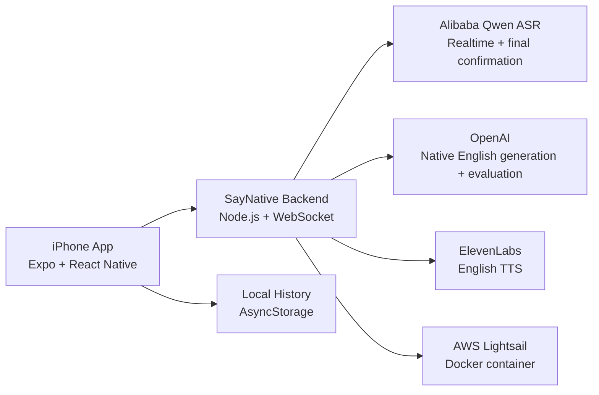

# SayNative

SayNative is an iPhone app that helps Chinese speakers turn everyday Chinese thoughts into natural spoken American English.

Instead of direct translation, SayNative focuses on intent, context, and high-frequency spoken phrasing. Users speak Chinese, optionally add a scene, hear natural American English options, repeat the phrase out loud, and get strict shadowing feedback.

## Features

- Chinese speech recognition with Alibaba Model Studio Qwen ASR
- Optional scene input for context-aware phrasing
- Natural spoken American English generation with OpenAI
- `Fast` and `More Native` generation modes
- English text-to-speech with ElevenLabs
- Strict repeat evaluation for shadowing practice
- Local practice history
- Dockerized Node.js backend deployed on AWS Lightsail

## How It Works

```text
Speak Chinese
-> transcribe speech
-> rewrite intent as spoken American English
-> play English audio
-> repeat the phrase
-> evaluate the repeat attempt
-> save useful practice history
```

SayNative's core language task is:

```text
Chinese intent -> natural spoken American English
```

See [Native Rewrite Design](docs/native-rewrite-design.md) for the prompt and quality strategy behind the English generation system.

## Tech Stack

- Expo / React Native
- TypeScript
- Node.js
- WebSocket realtime transcription
- Alibaba Model Studio Qwen ASR
- OpenAI
- ElevenLabs
- AWS Lightsail
- EAS iOS builds

## Getting Started

### Prerequisites

- Node.js
- npm
- Xcode for iPhone development
- Docker Desktop for backend deployment
- Expo / EAS account for iOS preview builds
- API keys for OpenAI, Alibaba Model Studio, and ElevenLabs

### Installation

```sh
npm install
```

Create a local environment file:

```sh
cp .env.example .env
```

Fill in the required API keys in `.env`.

### Run Checks

```sh
npm run check
```

### Run Backend Locally

```sh
npm run backend
```

The backend runs on:

```text
http://localhost:8787
```

Health check:

```text
http://localhost:8787/api/health
```

### Run iPhone App

For local iPhone development:

```sh
npx expo run:ios
```

For an internal iOS preview build:

```sh
npx eas-cli build --platform ios --profile preview
```

## Environment Variables

The iPhone app only receives the public backend URL.

Provider credentials stay on the backend and are never bundled into the mobile app.

Required backend variables:

```text
OPENAI_API_KEY
DASHSCOPE_API_KEY
ELEVENLABS_API_KEY
EXPO_PUBLIC_API_BASE_URL
```

Optional variables:

```text
OPENAI_MODEL
ELEVENLABS_MODEL_ID
QWEN_ASR_MODEL
QWEN_ASR_REALTIME_MODEL
QWEN_ASR_BASE_URL
QWEN_ASR_REALTIME_URL
SAYNATIVE_STT_PROVIDER
```

See [.env.example](.env.example) for the full configuration.

## Architecture



For more detail, see [ARCHITECTURE.md](ARCHITECTURE.md).

## Project Structure

```text
backend/                  Node.js API and realtime transcription server
backend/prompts/          OpenAI generation and rewrite prompts
src/hooks/                App session and recording state
src/lib/                  API clients, history, settings, realtime transcription
src/screens/              Main app and history screens
src/types/                Shared TypeScript types
docs/                     Product and prompt design documents
```

## Development Workflow

```sh
npm run check
git status
```

Recommended workflow:

1. Keep each change small and scoped.
2. Run checks before committing.
3. Commit one product or engineering change at a time.
4. Keep prompts, ASR, UI, and deployment changes separate when possible.

## Roadmap

- TestFlight beta for external testers
- Product screenshots and demo video
- Better weak-network transcription recovery
- More detailed pronunciation feedback
- Scene presets for restaurants, school, work, dating, and travel
- Spaced repetition and streaks

## Status

Beta in active development.

The backend is deployed on AWS Lightsail, and internal iPhone builds are distributed with EAS.

## License

This project is currently maintained as a personal product project.
